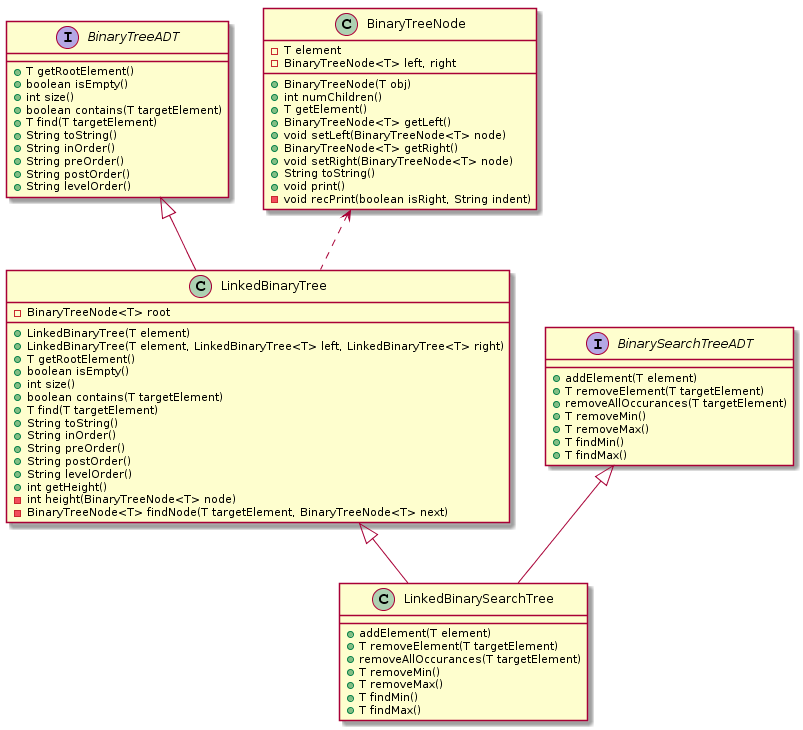

# A Linked Binary Search Tree

## Purpose
The purpose of this lab is to gain greater understanding of binary search trees.

## Evaluation
Students will be awarded up to 10 points for successfully completing this lab as
outlined below.

## Modify the Binary Search Tree program


Take a few minutes to examine the UML class diagram to understand the
relationships between the classes.

Run the program as follows:
```shell
javac *.java
java LinkedBinarySearchTreeTester
```
(You can ignore the warning message from the compiler.)
After the output is displayed, look at the code in your main
method and supporting classes and figure out what methods are used to
generate the output.

## Find/Search Method
Implement the `find` method in the `LinkedBinarySearchTree` class to add the
ability to search for an element in your tree. Study to understand how the
`addElement` method works and apply the same logic. Because the `LinkedBinarySearchTree`
class implements the `LinkedBinaryTree` class, it inherits a definition of the
`find` method, but we want to override this definition because this method can be
implemented more efficiently by taking advantage of the ordering property of
a Binary Search Tree. A set of test cases are included in the `main` method of
`LinkedBinarySearchTreeTester`. Your implementation should make all the test cases
pass.

## Remove Method
Study the `removeElement` method and answer the following questions.
* In removing an element from a binary search tree, another node must be promoted
to replace the node being removed. What rule does the algorithm use to find
the replacement node?
* What would be another reasonable choice for the replacement?

## Turn In
Please include the output from the test cases and your answers to the questions
in a `result.txt` file.
